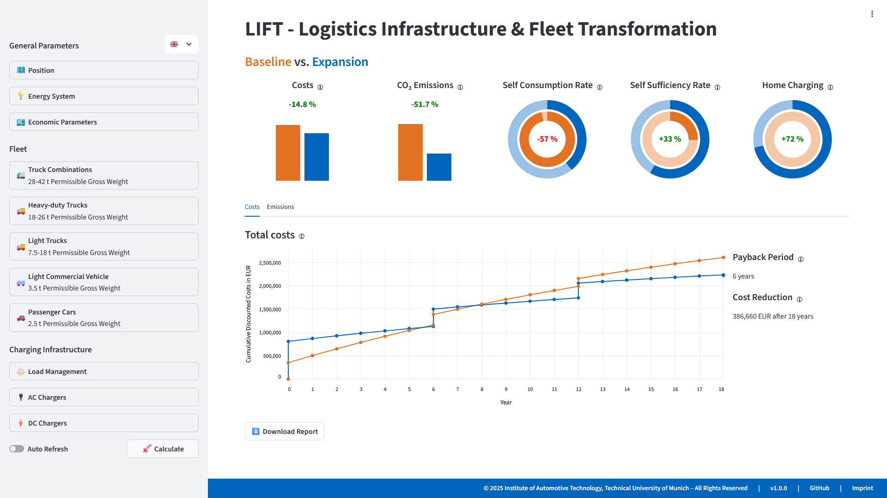

# LIFT

## Logistics Infrastructure & Fleet Transformation


## Created by 
Brian Dietermann, M.Sc. and Anna Paper, M.Sc.  
Institute of Automotive Technology  
Department of Mobility Systems Engineering  
TUM School of Engineering and Design  
Technical University of Munich  
brian.dietermann@tum.de  
anna.paper@tum.de  
2025

#### Contributors  
Philipp Rosner, M.Sc. - Research Associate  
Fabian Mayer, B.Sc. - Semester Thesis submitted 09/2025

## Installation

#### Step 1: Getting the source code
LIFT is available on the Institute of Automotive Technology's [GitHub](https://github.com/TUMFTM/LIFT) account as well as on [GitLab](https://gitlab.lrz.de/energysystemmodelling/lift) for users affiliated to the Institute of Automotive Technology.
To clone the repository use the following commands: 
```bash
git clone https://github.com/TUMFTM/LIFT.git
```
or
```bash
git clone https://gitlab.lrz.de/energysystemmodelling/lift.git
```

#### Step 2: Create a clean virtual environment
It is recommended to create and activate a clean virtual environment for the installation of LIFT.
This can be done using conda:
```bash
conda create -n <name_of_virtual_environment> python=3.11
conda activate <name_of_virtual_environment>
```
or alternatively with the following command:
```bash
python -m venv <path_to_virtual_environment>
source <path_to_virtual_environment>/bin/activate
```

#### Step 3: Install package and dependencies locally
After cloning the repository, navigate to its root directory (where ```README.md``` and ```pyproject.toml``` are located) in your terminal.
Then install the package and its dependencies using one of the following commands depending on the chosen mode of installation:
##### a) Standard Installation
This copies the package into your (virtual environment’s) site-packages directory:
```bash
pip install .
```
After pulling new changes from the repository, the package has to be reinstalled using the same command to take the changes into account.

##### b) Editable Installation (recommended for development)

This links the package to your local source code, so any changes (you make or pulled from the repository) are immediately reflected without reinstalling.
In addition to the packages required to run LIFT, the package pre-commit is installed.  
```bash
pip install -e . --group dev
```
Use the editable mode if you plan to modify the code during development.



## Basic Usage - GUI mode
LIFT can be run using one of two terminal commands, given the correct virtual environment is activated:
1. Call to the main module: ```python -m lift``` (best for local execution on host machine, e.g. through a run configuration in PyCharm)
2. Call to the entry point: ```lift``` (best for remote execution on a server as it works irrespective of the current working directory as long as the correct environment is active)

## Advanced Usage - GUI mode
LIFT includes predefined options for vehicles, chargers and other assumptions. Those can be found in the JSON files located in ```lift/data/*```.
To change those predefined values or create a new type of charger or vehicle modify or add a new entry to the JSON files.
If a new type of vehicle is added, providing an according mobility CSV files in ```lift/data/mobility/``` is required.
This file has to be named as the new type of vehicle.
With LIFT being installed in editable mode, the frontend will automatically include the changes made.
Otherwise, you have to reinstall LIFT after making changes to the JSON files.

## Server Usage - GUI mode
LIFT's GUI can also be run on a server and accessed remotely via a web browser.
For this, start LIFT with the following command:
```bash
lift
```

The GUI is served on the port shown in the terminal (default: 8501).
Forward or expose this port as needed and access it via the browser.

## Basic Usage - Scalable mode
LIFT as being clearly divided into a frontend and backend also features the option to only use the backend without the frontend.
This allows for scalable multi-scenario investigations.
Scenarios can either be defined using CSV files (```example/from_csv/```) or by directly defining a scenario or comparison object in Python code (```example/from_comparison_obj/```).
